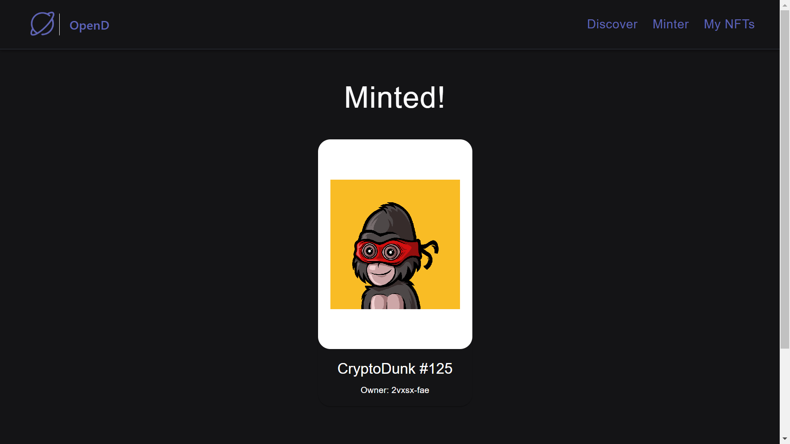

# OpenD (NFT Marketplace)
> This repository contains information about the OpenD (NFT Marketplace), which is built on the Internet Computer blockchain which is (100% on blockchain). The Internet Computer is a decentralized platform that allows for the creation, transfer and trading of NFTs.

## What is OpenD?
> OpenD is a decentralized platform that allows users to buy, sell, and trade NFTs (Non-Fungible Tokens), inspired from popular NFT Marketplace called [OpenSea](https://opensea.io/). NFTs are digital assets that are unique and cannot be replicated, They represent ownership of a digital asset like digital art, collectibles, in-game items, and more.

## How to use OpenD?
> Users can create an account on OpenD and connect it to a wallet that supports the blockchain [NANO token](https://github.com/Sindhuinti/nano-token/) then they can browse and discover NFTs, place bids or make offers to buy or sell, or create their own NFTs to sell.

## How to mint an NFT
> Users can mint their own NFTs by creating a digital asset and then using the marketplace's minting feature to create a unique token that represents ownership of that asset.

## :movie_camera: [Click here for demo](./demo/demo.mp4)



## Getting Started

These instructions will help you get a copy of the project up and running on your local machine for development and testing purposes.

### Prerequisites

Before you can run the code, you will need to have the following software installed:

- [Internet Computer CLI](https://docs.dfinity.org/docs/sdk/install)
- [Node](https://nodejs.org/en/)

### Installing
1. Clone the repository: `git clone https://github.com/Sindhuinti/nft-dfinity.git`
2. Navigate to the project directory: `cd opend`

## To Install and Run the Project

1. start local dfx

```
dfx start --clean
```

2. Run NPM server

```
npm start
```

3. Deploy canisters

```
dfx deploy --argument='("CryptoDunks #123", principal "kxxwb-2qfgb-jybis-wpok2-izxvd-2ng77-23wh5-iiyr3-ukdxp-6oamk-5qe", (vec {137; 80; 78; 71; 13; 10; 26; 10; 0; 0; 0; 13; 73; 72; 68; 82; 0; 0; 0; 10; 0; 0; 0; 10; 8; 6; 0; 0; 0; 141; 50; 207; 189; 0; 0; 0; 1; 115; 82; 71; 66; 0; 174; 206; 28; 233; 0; 0; 0; 68; 101; 88; 73; 102; 77; 77; 0; 42; 0; 0; 0; 8; 0; 1; 135; 105; 0; 4; 0; 0; 0; 1; 0; 0; 0; 26; 0; 0; 0; 0; 0; 3; 160; 1; 0; 3; 0; 0; 0; 1; 0; 1; 0; 0; 160; 2; 0; 4; 0; 0; 0; 1; 0; 0; 0; 10; 160; 3; 0; 4; 0; 0; 0; 1; 0; 0; 0; 10; 0; 0; 0; 0; 59; 120; 184; 245; 0; 0; 0; 113; 73; 68; 65; 84; 24; 25; 133; 143; 203; 13; 128; 48; 12; 67; 147; 94; 97; 30; 24; 0; 198; 134; 1; 96; 30; 56; 151; 56; 212; 85; 68; 17; 88; 106; 243; 241; 235; 39; 42; 183; 114; 137; 12; 106; 73; 236; 105; 98; 227; 152; 6; 193; 42; 114; 40; 214; 126; 50; 52; 8; 74; 183; 108; 158; 159; 243; 40; 253; 186; 75; 122; 131; 64; 0; 160; 192; 168; 109; 241; 47; 244; 154; 152; 112; 237; 159; 252; 105; 64; 95; 48; 61; 12; 3; 61; 167; 244; 38; 33; 43; 148; 96; 3; 71; 8; 102; 4; 43; 140; 164; 168; 250; 23; 219; 242; 38; 84; 91; 18; 112; 63; 0; 0; 0; 0; 73; 69; 78; 68; 174; 66; 96; 130;}))'
```

4. Head to localhost

http://localhost:8080/


# Creating NFT for Testing

1. Mint an NFT on the command line to get NFT into mapOfNFTs:

```
dfx canister call opend mint '(vec {137; 80; 78; 71; 13; 10; 26; 10; 0; 0; 0; 13; 73; 72; 68; 82; 0; 0; 0; 10; 0; 0; 0; 10; 8; 6; 0; 0; 0; 141; 50; 207; 189; 0; 0; 0; 1; 115; 82; 71; 66; 0; 174; 206; 28; 233; 0; 0; 0; 68; 101; 88; 73; 102; 77; 77; 0; 42; 0; 0; 0; 8; 0; 1; 135; 105; 0; 4; 0; 0; 0; 1; 0; 0; 0; 26; 0; 0; 0; 0; 0; 3; 160; 1; 0; 3; 0; 0; 0; 1; 0; 1; 0; 0; 160; 2; 0; 4; 0; 0; 0; 1; 0; 0; 0; 10; 160; 3; 0; 4; 0; 0; 0; 1; 0; 0; 0; 10; 0; 0; 0; 0; 59; 120; 184; 245; 0; 0; 0; 113; 73; 68; 65; 84; 24; 25; 133; 143; 203; 13; 128; 48; 12; 67; 147; 94; 97; 30; 24; 0; 198; 134; 1; 96; 30; 56; 151; 56; 212; 85; 68; 17; 88; 106; 243; 241; 235; 39; 42; 183; 114; 137; 12; 106; 73; 236; 105; 98; 227; 152; 6; 193; 42; 114; 40; 214; 126; 50; 52; 8; 74; 183; 108; 158; 159; 243; 40; 253; 186; 75; 122; 131; 64; 0; 160; 192; 168; 109; 241; 47; 244; 154; 152; 112; 237; 159; 252; 105; 64; 95; 48; 61; 12; 3; 61; 167; 244; 38; 33; 43; 148; 96; 3; 71; 8; 102; 4; 43; 140; 164; 168; 250; 23; 219; 242; 38; 84; 91; 18; 112; 63; 0; 0; 0; 0; 73; 69; 78; 68; 174; 66; 96; 130;}, "CryptoDunks #123")'
```

2. List the item into mapOfListings:

```
dfx canister call opend listItem '(principal "<Replace with NFT Principal id>", 2)'
```

3. Get OpenD canister ID:

```
dfx canister id opend
```

4. Transfer NFT to OpenD:

```
dfx canister call <Replace with NFT id> transferOwnership '(principal "<Replace with opend canister id>", true)'
```

## Usage

Once the tokens are deployed, you can interact with them using the Internet Computer CLI. See the [DFinity documentation](https://docs.dfinity.org/docs/sdk/ic-cli) for more information on how to do this.

## Contributing

If you would like to contribute to the development of these tokens, please fork the repository and create a pull request.

